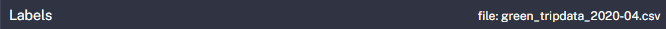
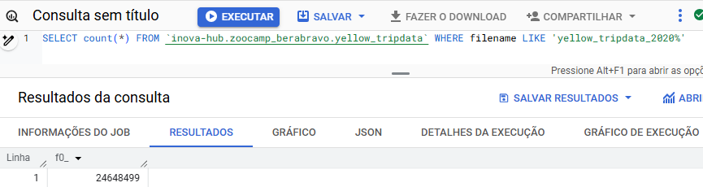
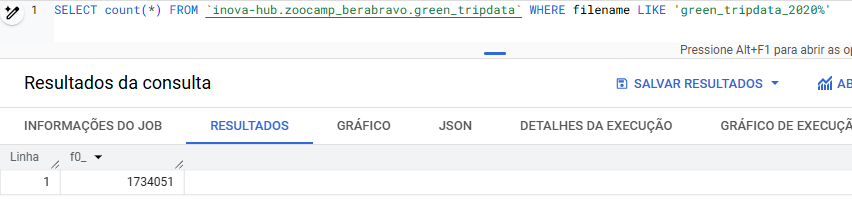
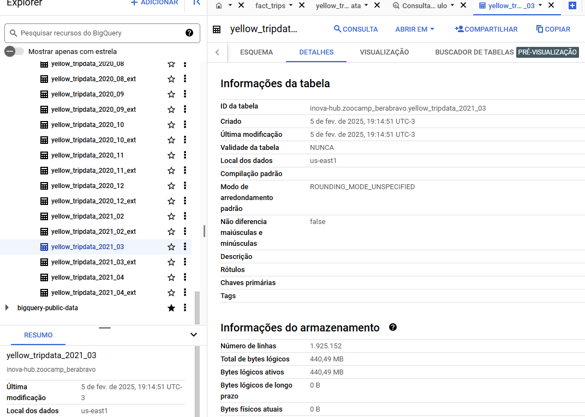
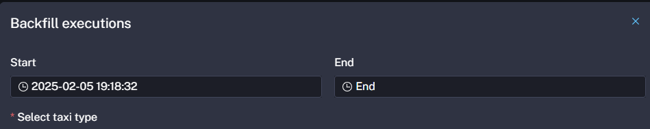

<h1 align="center">Welcome to berazoode25 👋</h1>

  

> Data Engineering Zoocamp Homework of BeraBravo

## Author

👤 **BeraBravo**

* Github: [@BeraBravo](https://github.com/BeraBravo)

##  Docker and terraform 

### Question 1. Understanding docker first run

> commands: 

docker run -it --entrypoint bash python:3.12.8´
pip --version

> output:
pip 24.3.1 from /usr/local/lib/python3.12/site-packages/pip (python 3.12)

> anwser: pip 24.3.1 

### Question 2. Understanding Docker networking and docker-compose

> commands:

docker-compose up

> output:
host=postgres port=5432 dbname=postgres user=postgres password=xxxxxxx connect_timeout=10 sslmode=prefer sslcert=<STORAGE_DIR>/.postgresql/postgresql.crt sslkey=<STORAGE_DIR>/.postgresql/postgresql.key

> anwser : postgres:5433

### Question 3. Trip Segmentation Count

> commands: 

SELECT
  SUM(CASE WHEN trip_distance <= 1 THEN 1 ELSE 0 END) AS up_to_1_mile,
  SUM(CASE WHEN trip_distance > 1 AND trip_distance <= 3 THEN 1 ELSE 0 END) AS between_1_and_3_miles,
  SUM(CASE WHEN trip_distance > 3 AND trip_distance <= 7 THEN 1 ELSE 0 END) AS between_3_and_7_miles,
  SUM(CASE WHEN trip_distance > 7 AND trip_distance <= 10 THEN 1 ELSE 0 END) AS between_7_and_10_miles,
  SUM(CASE WHEN trip_distance > 10 THEN 1 ELSE 0 END) AS over_10_miles
FROM
  yellow_taxi_trips
WHERE
  tpep_pickup_datetime >= '2019-10-01' AND tpep_pickup_datetime < '2019-11-01';

> output:

"up_to_1_mile"	"between_1_and_3_miles"	"between_3_and_7_miles"	"between_7_and_10_miles"	"over_10_miles"
1938570	3445091	1097906	285432	446589

> anwser:

"up_to_1_mile"	"between_1_and_3_miles"	"between_3_and_7_miles"	"between_7_and_10_miles"	"over_10_miles"
1938570	3445091	1097906	285432	446589

### Question 4. Longest trip for each day

> commands: 

WITH RankedTrips AS (
    SELECT
        tpep_pickup_datetime::date AS pickup_date,  -- Cast to date
        trip_distance,
        ROW_NUMBER() OVER (PARTITION BY tpep_pickup_datetime::date ORDER BY trip_distance DESC) AS rn
    FROM yellow_taxi_trips
    WHERE tpep_pickup_datetime >= '2019-10-01' AND tpep_pickup_datetime < '2019-11-01'
)
SELECT pickup_date, trip_distance
FROM RankedTrips
WHERE rn = 1
ORDER BY trip_distance DESC
LIMIT 1;

> output:

"pickup_date"	"trip_distance"
"2019-10-20"	307.95

> anwser:  

"pickup_date"	"trip_distance"
"2019-10-20"	307.95

### Question 5. Three biggest pickup zones

> commands: 

SELECT
    zone
FROM
    yellow_taxi_trips ytt
JOIN
    taxi_zone_lookup tzl ON lower(ytt."PULocationID"::text) = lower(tzl.locationid::text) -- Case-insensitive comparison
WHERE
    tpep_pickup_datetime::date = '2019-10-18'
GROUP BY
    zone
HAVING
    SUM(total_amount) > 13000;

> output:

"zone"
"Battery Park City"
"Central Harlem"
"Central Park"
"Clinton East"
"Clinton West"
"East Chelsea"
"East Harlem North"
"East Harlem South"
"East Village"

> anwser:  

"zone"
"Battery Park City"
"Central Harlem"
"Central Park"
"Clinton East"
"Clinton West"
"East Chelsea"
"East Harlem North"
"East Harlem South"
"East Village"

### Question 6. Largest tip

> commands: 

SELECT tzl_dropoff.zone AS dropoff_zone
FROM yellow_taxi_trips ytt
JOIN taxi_zone_lookup tzl_pickup ON ytt."PULocationID" = tzl_pickup.locationid  -- Double quotes for case-sensitivity
JOIN taxi_zone_lookup tzl_dropoff ON ytt."DOLocationID" = tzl_dropoff.locationid  -- Double quotes for case-sensitivity
WHERE tzl_pickup.zone = 'East Harlem North'
  AND ytt.tpep_pickup_datetime BETWEEN '2019-10-01' AND '2019-10-31'
ORDER BY ytt.tip_amount DESC
LIMIT 1;

> output:

"dropoff_zone"
"West Concourse"

> anwser: 

"dropoff_zone"
"West Concourse"

### Question 7. Terraform Workflow

> commands: 

terraform init
terraform apply -auto-approve

> anwser: 

terraform init, terraform apply -auto-approve, terraform destroy

Give a ⭐️ if this project helped you!

***
_This README was generated with ❤️ by [readme-md-generator](https://github.com/kefranabg/readme-md-generator)_

##  Docker and terraform 

### Question 1. File size (1 point)

> anwser: 
128.3 MB

### Question 2. Rendered value (1 point)

> anwser: 
green_tripdata_2020-04.csv

### Question 3. Number of rows (yellow, 2020)

> anwser: 
24,648,499

### Question 4. Number of rows (green, 2020)

> anwser: 
1734051

### Question 5. Number of rows (yellow, March 2021) (1 point)

> anwser: 
1,925,152

### Question 6. Timezone for trigger 

> anwser: 
Add a timezone property set to America/New_York in the Schedule trigger configuration

